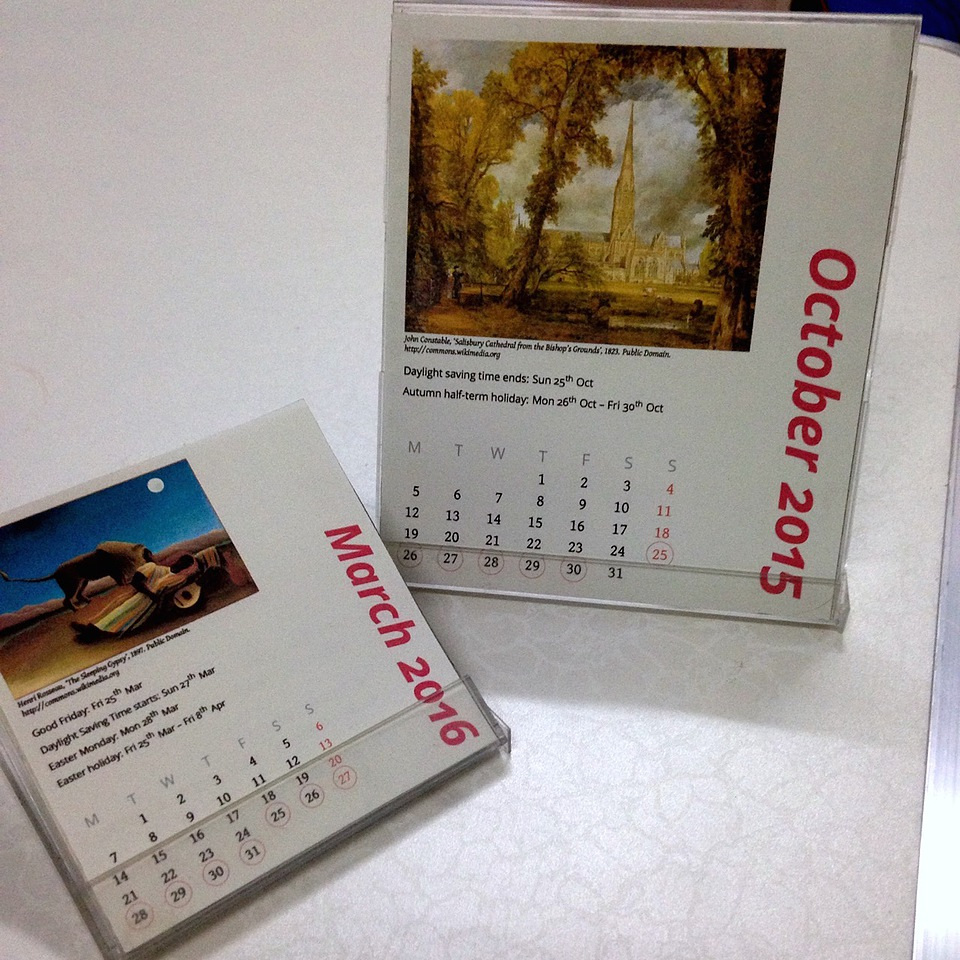

# Customisable multilingual calendars with LaTeX

The calendars are printed 4-up to fit 3.5" floppy disk jewel cases, or 2-up to fit CD jewel cases. There is now also a full-page version for wall calendars as of Dec 2016.



Colours, illustrations, fonts etc are customisable. The calendars can be marked with events with date ranges (updated June 22, 2015). See [this blog post](https://www.overleaf.com/blog/217-a-multilingual-customisable-cd-slash-floppy-disk-jewel-case-calendar-with-latex) for more information (syntax of some commands have changed though),
or open and edit a [CD-sized](https://www.overleaf.com/read/htkctjjgmxjx), [floppy disk-sized](https://www.overleaf.com/read/vtqtzgbcvmbg) or [full-page](https://www.overleaf.com/read/csttbxxjydvz) calendar template on Overleaf.


## Language Localisation

Localisation possible with languages supported by `babel`/`translator`/`datetime2`.

Tested with british, spanish, french, ngerman, italian, portuges, polish, croatian, greek.

If using `pdflatex` for greek, remember to load `LGR,T1` for `fontenc`.

If using `pdflatex` for french, add these lines in the preamble:

````
\tikzset{%
  every picture/.prefix style={execute at begin picture=\shorthandoff{;}}
}
````

The Chinese example is best compiled with XeLaTeX. The Japanese example is best compiled with LuaLaTeX.

For (partially) unsupported languages or if you'd like to customise the localisations yourself, either because the language isn't supported by babel and translator, or because the language doesn't lend itself well to having the first letter extracted for the week day headings (e.g. Chinese), you can. In this case do your own modifications; see `ChineseCalendar.tex` and `zh-mod.sty` for an example. You'll most likely want to stop `cdcalendar` from loading babel in this case, so use the `nobabel` option:

    \documentclass[sundayweek,nobabel]{cdcalendar}
    \usepackage{zh-mod}

You can still write `\usepackage[...]{babel}` yourself in the preamble (for hyphenations etc), but it won't have any effects on the month and week day names , nor the date localisations; you'll have to provide your own mods. Example for Bahasa Indonesia:

    \documentclass[nobabel]{cdcalendar}    % don't load babel yet!
    \usepackage{id-mod}   % our own Bahasas Indonesian localisation
    \usepackage[bahasai]{babel}  % if you need Indonesian hyphenation patterns


I'll add mods for other languages from time to time when I feel like it. ;-)

# Marking Events on the Calendar

An example of a month calendar with events (syntax updated in v1.2):

    \begin{monthCalendar}{2015}{10}

    %% This is a 1-day event
    \event{2015-10-25}{}{Daylight saving time ends}

    %% This is a 5-day event starting Oct 26th
    \event{2015-10-26}{5}{Autumn half-term holiday}

    %% You could also write
    %\event{2015-10-26}{2015-10-30}{Autumn half-term holiday}
    \end{monthCalendar}
    \clearpage %% Do remember this; I guess I could have made it automatic but well.

The events mark and style can be customised: (All `\tikzset` styles for use with
`mark style` should be issued in the document preamble; new in v1.2)

    % In the preamble
    \tikzset{blue icon/.style={text=SkyBlue!60,font=\large}}
    % In the monthCalendar
    \event[mark style=blue icon, marker=\faCake]{2015-10-10}{Someone's birthday}

Currently the value for `mark style` must be a single style name.


## Cover and Calendar Illustrations

For the cover page:

    \coverBgColor{black}
    \coverImage[caption]{image-filename}
    \coverTitle[tikz style]{Calendar Title}

    \makeCover


You can add an illustration on each page (the length is the width of the image). Note that this needs to be issued _outside_ the `monthCalendar` environment.

    \illustration[image caption]{8.5cm}{filename.png}

...or in fact you could insert anything that'll be typeset as a minipage: (new in v1.2)

    \otherstuff[caption]{8.5cm}{\Huge Perhaps a Smart Quote Here?}


## Other settings

There are a few other settings you can set as well. These can be re-issued at any point in the document to change the styles.

    \dayHeadingStyle{font=\sffamily\color{gray!90}}
    \sundayColor{red}
    \monthTitleStyle{font={\Huge\sffamily}, RoyalBlue}
    \eventStyle{\scriptsize\sffamily}
    \newcommand{\printeventname}[1]{\textbf{#1}}   % can be renewed
    \newcommand{\eventSep}{: }  % can be renewed

## Multiple calendar systems

`ChineseLunarCalendar.tex` demonstrates how another calendar system, e.g. the Chinese lunar calendar, can be incorporated. The mapping between the Chinese lunar calenar and the Gregorian calendar was downloaded from [here](https://github.com/infinet/lunar-calendar/blob/master/chinese_lunar_prev_year_next_year.ics) and then converted to a `.csv` file with [this tool](https://www.indigoblue.eu/ics2csv/).
